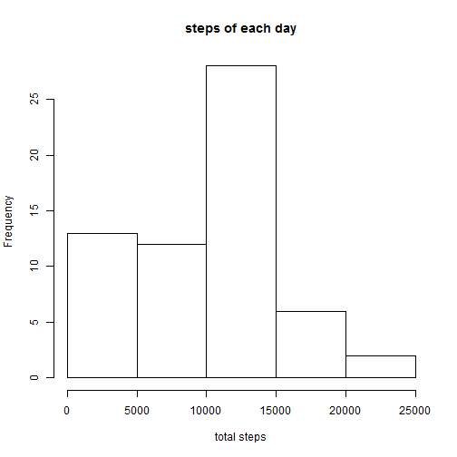
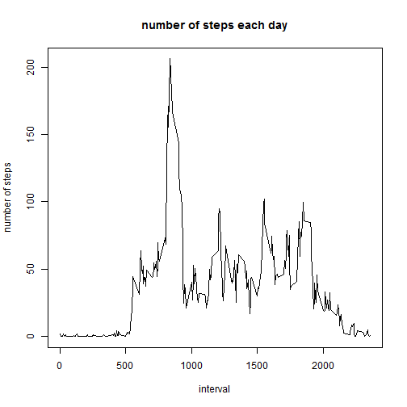
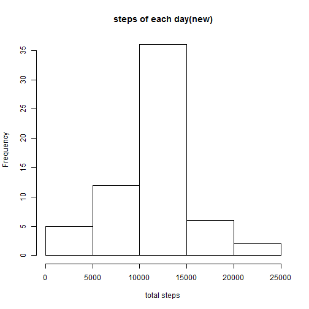
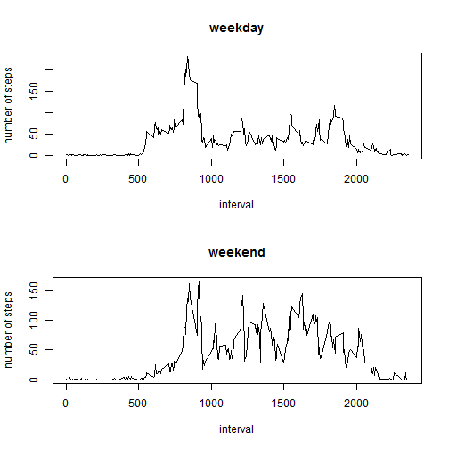

# Reproducible Research: Peer Assessment 1


## Loading and preprocessing the data


```r
unzip("activity.zip")
act <- read.csv("activity.csv")
act <- transform(act, date = as.Date(date))
```


## What is mean total number of steps taken per day?


```r
sum_steps <- tapply(act$steps, act$date, sum, na.rm = T)
hist(sum_steps, main = "steps of each day", xlab = "total steps")
```

 

```r
dev.off()
```

```
## null device 
##           1
```


```r
mean_steps <- tapply(act$steps, act$date, mean, na.rm = T)
median_steps <- tapply(act$steps, act$date, median, na.rm = T)
report <- cbind(mean_steps, median_steps)
colnames(report) <- c("mean", "median")
report
```

```
##               mean median
## 2012-10-01     NaN     NA
## 2012-10-02  0.4375      0
## 2012-10-03 39.4167      0
## 2012-10-04 42.0694      0
## 2012-10-05 46.1597      0
## 2012-10-06 53.5417      0
## 2012-10-07 38.2465      0
## 2012-10-08     NaN     NA
## 2012-10-09 44.4826      0
## 2012-10-10 34.3750      0
## 2012-10-11 35.7778      0
## 2012-10-12 60.3542      0
## 2012-10-13 43.1458      0
## 2012-10-14 52.4236      0
## 2012-10-15 35.2049      0
## 2012-10-16 52.3750      0
## 2012-10-17 46.7083      0
## 2012-10-18 34.9167      0
## 2012-10-19 41.0729      0
## 2012-10-20 36.0938      0
## 2012-10-21 30.6285      0
## 2012-10-22 46.7361      0
## 2012-10-23 30.9653      0
## 2012-10-24 29.0104      0
## 2012-10-25  8.6528      0
## 2012-10-26 23.5347      0
## 2012-10-27 35.1354      0
## 2012-10-28 39.7847      0
## 2012-10-29 17.4236      0
## 2012-10-30 34.0938      0
## 2012-10-31 53.5208      0
## 2012-11-01     NaN     NA
## 2012-11-02 36.8056      0
## 2012-11-03 36.7049      0
## 2012-11-04     NaN     NA
## 2012-11-05 36.2465      0
## 2012-11-06 28.9375      0
## 2012-11-07 44.7326      0
## 2012-11-08 11.1771      0
## 2012-11-09     NaN     NA
## 2012-11-10     NaN     NA
## 2012-11-11 43.7778      0
## 2012-11-12 37.3785      0
## 2012-11-13 25.4722      0
## 2012-11-14     NaN     NA
## 2012-11-15  0.1424      0
## 2012-11-16 18.8924      0
## 2012-11-17 49.7882      0
## 2012-11-18 52.4653      0
## 2012-11-19 30.6979      0
## 2012-11-20 15.5278      0
## 2012-11-21 44.3993      0
## 2012-11-22 70.9271      0
## 2012-11-23 73.5903      0
## 2012-11-24 50.2708      0
## 2012-11-25 41.0903      0
## 2012-11-26 38.7569      0
## 2012-11-27 47.3819      0
## 2012-11-28 35.3576      0
## 2012-11-29 24.4688      0
## 2012-11-30     NaN     NA
```


## What is the average daily activity pattern?


```r
ave_steps <- tapply(act$steps, act$interval, mean, na.rm = T)
plot(unique(act$interval), ave_steps, type = "l", xlab = "interval", ylab = "number of steps", 
    main = "number of steps each day")
```

 

```r
dev.off()
```

```
## null device 
##           1
```

```r
wr <- names(which.max(ave_steps))
```


* The "835" interval contains the maximum number of steps across the days in the dataset.

## Imputing missing values


```r
nas <- is.na(act$steps)
num_nas <- sum(nas)
```


* There are 2304 NAs in the dataset.

* Filling in all of the missing values in the dataset with the mean of the 5-minute interval steps.


```r
newact <- act
newact[nas, "steps"] <- ave_steps
```


```r
newsum_steps <- tapply(newact$steps, newact$date, sum, na.rm = T)
hist(newsum_steps, main = "steps of each day(new)", xlab = "total steps")
```

 

```r
dev.off()
```

```
## null device 
##           1
```


```r
newmean_steps <- tapply(newact$steps, newact$date, mean, na.rm = T)
newmedian_steps <- tapply(newact$steps, newact$date, median, na.rm = T)
new_report <- cbind(newmean_steps, newmedian_steps)
colnames(new_report) <- c("new_mean", "new_median")
new_report
```

```
##            new_mean new_median
## 2012-10-01  37.3826      34.11
## 2012-10-02   0.4375       0.00
## 2012-10-03  39.4167       0.00
## 2012-10-04  42.0694       0.00
## 2012-10-05  46.1597       0.00
## 2012-10-06  53.5417       0.00
## 2012-10-07  38.2465       0.00
## 2012-10-08  37.3826      34.11
## 2012-10-09  44.4826       0.00
## 2012-10-10  34.3750       0.00
## 2012-10-11  35.7778       0.00
## 2012-10-12  60.3542       0.00
## 2012-10-13  43.1458       0.00
## 2012-10-14  52.4236       0.00
## 2012-10-15  35.2049       0.00
## 2012-10-16  52.3750       0.00
## 2012-10-17  46.7083       0.00
## 2012-10-18  34.9167       0.00
## 2012-10-19  41.0729       0.00
## 2012-10-20  36.0938       0.00
## 2012-10-21  30.6285       0.00
## 2012-10-22  46.7361       0.00
## 2012-10-23  30.9653       0.00
## 2012-10-24  29.0104       0.00
## 2012-10-25   8.6528       0.00
## 2012-10-26  23.5347       0.00
## 2012-10-27  35.1354       0.00
## 2012-10-28  39.7847       0.00
## 2012-10-29  17.4236       0.00
## 2012-10-30  34.0938       0.00
## 2012-10-31  53.5208       0.00
## 2012-11-01  37.3826      34.11
## 2012-11-02  36.8056       0.00
## 2012-11-03  36.7049       0.00
## 2012-11-04  37.3826      34.11
## 2012-11-05  36.2465       0.00
## 2012-11-06  28.9375       0.00
## 2012-11-07  44.7326       0.00
## 2012-11-08  11.1771       0.00
## 2012-11-09  37.3826      34.11
## 2012-11-10  37.3826      34.11
## 2012-11-11  43.7778       0.00
## 2012-11-12  37.3785       0.00
## 2012-11-13  25.4722       0.00
## 2012-11-14  37.3826      34.11
## 2012-11-15   0.1424       0.00
## 2012-11-16  18.8924       0.00
## 2012-11-17  49.7882       0.00
## 2012-11-18  52.4653       0.00
## 2012-11-19  30.6979       0.00
## 2012-11-20  15.5278       0.00
## 2012-11-21  44.3993       0.00
## 2012-11-22  70.9271       0.00
## 2012-11-23  73.5903       0.00
## 2012-11-24  50.2708       0.00
## 2012-11-25  41.0903       0.00
## 2012-11-26  38.7569       0.00
## 2012-11-27  47.3819       0.00
## 2012-11-28  35.3576       0.00
## 2012-11-29  24.4688       0.00
## 2012-11-30  37.3826      34.11
```


* There are no differences between these values and the estimates from the first part of the assignment.

* Imputing missing data on the estimates of the total daily number of steps removes the NAs and make the dataset clean with the statistical informations unchanged.

## Are there differences in activity patterns between weekdays and weekends?


```r
Sys.setlocale(locale = "C")
```

```
## [1] "C"
```

```r
wkday <- weekdays(newact$date)
week <- character(length(newact$date))
for (i in seq(week)) {
    if (wkday[i] == "Saturday" | wkday[i] == "Sunday") 
        week[i] = "weekend" else week[i] = "weekday"
}
week <- as.factor(week)
```


```r
mean1 <- tapply(newact[week == "weekday", "steps"], newact[week == "weekday", 
    "interval"], mean)
mean2 <- tapply(newact[week == "weekend", "steps"], newact[week == "weekend", 
    "interval"], mean)

par(mfrow = c(2, 1))
plot(unique(newact$interval), mean1, main = "weekday", type = "l", xlab = "interval", 
    ylab = "number of steps")
plot(unique(newact$interval), mean2, main = "weekend", type = "l", xlab = "interval", 
    ylab = "number of steps")
```

 

```r
dev.off()
```

```
## null device 
##           1
```

